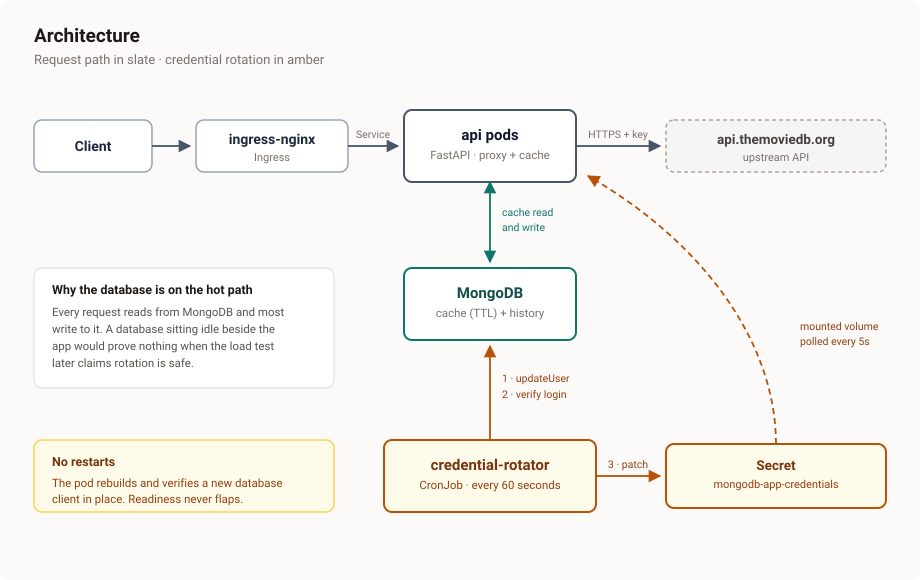
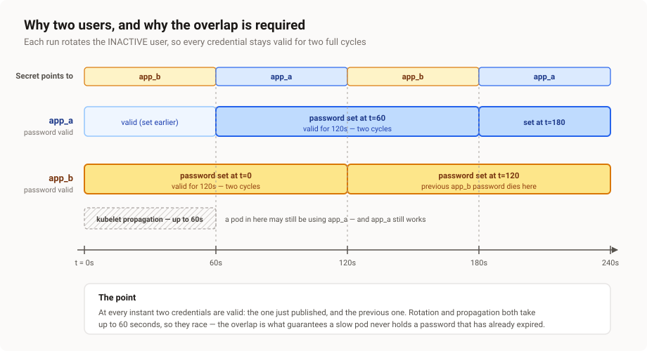

# Lumana — API proxy with zero-downtime credential rotation

A caching proxy over a public text-search API, running on Kubernetes, whose database
credentials are rotated **every 60 seconds** by a CronJob — without dropping a single
request or restarting a single pod.

Everything the brief asked for is here. The part worth your attention is
[how the rotation works](#the-interesting-part-rotation-without-downtime), because that is
where the design decisions actually are.

---

## Architecture



Request flow: validate query → look in the MongoDB cache → on a miss call TMDB, store the
result with a TTL index → record the query in history → return. The database is
deliberately on the hot path, so a broken connection cannot hide behind a cache.

### Why two users, and why the overlap matters



Each run rotates the **inactive** user, then points the Secret at it. The rotator
authenticates as that user *before* publishing — if verification fails it aborts without
touching the Secret, and pods keep the previous credential, which is still valid.

On the application side a rotation is four steps, none of which restart anything:

1. The poll notices the mounted credential files changed.
2. Build a **new** MongoDB client — the old one is still serving traffic.
3. Ping it. If it fails, discard it and keep serving on the old client.
4. Swap the reference atomically, then close the old client after a drain delay.

Because the active client is only ever replaced by one already proven to work, readiness
never flaps — so the Service never removes the pod, so nothing returns 503.

---

## Quick start

### Local, with Docker Compose

```bash
make up && make smoke
```

Generates gitignored credentials, builds the image, starts MongoDB and the API, and
exercises the endpoints. Add a free [TMDB API key](https://www.themoviedb.org/settings/api)
to `.env` for `/search` to return data.

Watch a rotation happen without a cluster:

```bash
make rotate-local
```

### Local Kubernetes, with kind

```bash
make dev          # create cluster, install ingress-nginx, build images, deploy
make status
make watch-rotation
```

The API is then at <http://lumana.localtest.me:8080> — `localtest.me` resolves to
127.0.0.1, so no `/etc/hosts` editing is needed.

### Prove the zero-downtime claim

```bash
make loadtest
```

Six minutes of constant load spanning at least five rotations. The run **fails** if any
request returns non-2xx, and also fails if fewer than five rotations occurred — so a green
result cannot be achieved by simply not rotating.

### GCP

```bash
cd terraform
terraform apply
```

Creates two GKE clusters (staging, production), Artifact Registry, Secret Manager, KMS,
and Workload Identity Federation for CI. Run `terraform destroy` when finished — the
`estimated_hourly_cost_usd` output tells you what it costs while it exists (roughly
$0.19/hour with Spot nodes).

---

## The interesting part: rotation without downtime

The naive approach is to patch the Secret and run `kubectl rollout restart`. It works, and
it restarts every pod every sixty seconds forever. Pods never reach steady state, and
calling that zero downtime is a stretch.

This does it without restarts.

**Two MongoDB users alternate.** Each run rotates whichever of `app_a` / `app_b` is *not*
currently in use, then points the Secret at it. A published credential therefore stays
valid for two full cycles.

That overlap is required, not decorative: a mounted Secret can take **up to 60 seconds**
to propagate to a pod, and the schedule is also 60 seconds, so propagation and rotation
race each other. Rotating the inactive user means a pod that has not yet noticed the change
still holds a credential that works.

**The Secret is mounted as a volume, not injected as environment variables.** Environment
variables are frozen at process start and cannot rotate. This is the single most common
mistake on this task.

**The application swaps clients rather than restarting.** It builds a new client, pings it
to confirm the credential works, atomically swaps the active reference, then closes the old
client after a drain delay so in-flight queries finish. Because the active client is only
ever replaced by a verified-working one, readiness never flaps — so the Service never
removes the pod, so nothing 503s.

**The rotator publishes last.** It updates the password, authenticates as that user to
prove it works, and only then patches the Secret. If verification fails it aborts without
touching the Secret, and pods keep using the previous credential — which is still valid.

Full reasoning, including rejected alternatives: **[docs/DECISIONS.md](docs/DECISIONS.md)**
and **[docs/SECRETS.md](docs/SECRETS.md)**.

---

## How the brief maps to this repo

| Requirement | Where |
|---|---|
| Web server in Python or Node.js | [app/src/main.py](app/src/main.py) — FastAPI |
| Public API with text queries | TMDB — [app/src/upstream.py](app/src/upstream.py) |
| Proxy the API | `GET /search?q=` |
| Dockerize | [app/Dockerfile](app/Dockerfile) — multi-stage, non-root |
| MongoDB via Docker | [docker-compose.yml](docker-compose.yml), [k8s/base/mongodb.yaml](k8s/base/mongodb.yaml) |
| Connection via environment variables | [app/src/config.py](app/src/config.py) — ConfigMap-driven |
| Docker Compose | [docker-compose.yml](docker-compose.yml) |
| Kubernetes cluster | kind (dev) + two GKE clusters via [terraform/](terraform/) |
| Kustomize, three environments | [k8s/overlays/](k8s/overlays/) |
| Kustomize controls ports and URLs | `configMapGenerator` per overlay |
| Ingress and Services | [k8s/base/ingress.yaml](k8s/base/ingress.yaml), [k8s/base/api.yaml](k8s/base/api.yaml) |
| Secret for the exposed API | Secret Manager → [External Secrets](k8s/components/external-secrets/) → Kubernetes Secret |
| Secret for database credentials, used in pods | [k8s/base/secrets.yaml](k8s/base/secrets.yaml), mounted in [api.yaml](k8s/base/api.yaml) |
| CronJob rotating every minute, zero downtime | [k8s/base/rotator.yaml](k8s/base/rotator.yaml), [rotator/src/rotate.py](rotator/src/rotate.py) |

### Two ambiguities, and how they were read

*"Create a Kubernetes secret for the exposed API"* is read as the credential for the
**upstream** API being proxied. It could alternatively mean credentials protecting the API
this service exposes; the first reading was chosen because it is the only one that follows
from "select any public API" earlier in the brief.

*"Three different clusters"* is read literally — three distinct clusters, not three
namespaces.

---

## Security

**Pods.** Non-root, read-only root filesystem, no privilege escalation, all capabilities
dropped, `RuntimeDefault` seccomp. Namespaces enforce the `restricted` Pod Security
Standard, so the API server *rejects* a pod that violates this rather than running it. The
API pod sets `automountServiceAccountToken: false` — it never talks to the Kubernetes API.

**RBAC.** The rotator is the only component with any Kubernetes API access. Its Role is
namespaced, pinned to a single Secret by `resourceNames`, and limited to `get` and `patch`.
Deliberately no `list` or `watch`: those verbs ignore `resourceNames` and would expose every
Secret in the namespace.

**Network.** Default-deny on both ingress and egress, then explicit allows. Egress
default-deny is the half people skip, and it is what stops a compromised container from
calling out.

**GCP.** Nodes run under a dedicated least-privilege service account rather than the
default Compute Engine account, which carries project-wide Editor. Workload Identity means
pods get GCP identity with no key files. Shielded nodes, Dataplane V2, and Cloud KMS
envelope encryption of Secrets in etcd.

**Supply chain.** Multi-stage builds on slim bases, Trivy failing the build on HIGH and
CRITICAL, and CI authenticating through Workload Identity Federation — **no service account
key exists anywhere**, scoped by an attribute condition to this repository alone.

**Secrets.** Nothing secret is committed. Local development uses gitignored files generated
by `scripts/bootstrap-local.sh`; staging and production pull from GCP Secret Manager.

---

## What I would do differently with more time

**Dynamic per-workload credentials** instead of rotating a shared user — Vault's database
secrets engine, or Secret Manager with a rotation function. Then a leaked credential
identifies its holder and revocation is per-consumer rather than global. Rotating a shared
user is the right scope for this exercise; it is not what I would run at scale.

**Private nodes with Cloud NAT.** Implemented and one variable away
(`enable_private_nodes`), left off because NAT costs roughly $32/month per cluster — more
than everything else here combined. A deliberate, priced trade-off rather than an oversight.

**MongoDB as a replica set**, so the database is not a single point of failure. The
application already survives credential rotation; it would not survive losing its only
database pod.

**SHA-pinned GitHub Actions**, rather than version tags. Tags are mutable.

**Real observability** — Prometheus metrics on rotation lag and swap duration, and an alert
when the rotator has not succeeded in two cycles. Right now a silently failing rotator would
only be noticed once credentials expired.

---

## Repo layout

```
app/                    FastAPI proxy: routes, cache, credential watcher
rotator/                CronJob payload: rotates MongoDB users, patches the Secret
k8s/base/               Namespace, MongoDB, API, RBAC, CronJob, Ingress, NetworkPolicies
k8s/overlays/           dev (kind) / staging / production
k8s/components/         Shared fragments — External Secrets for the cloud environments
terraform/              GKE, Artifact Registry, Secret Manager, KMS, Workload Identity
load/                   k6 test that proves the zero-downtime claim
docs/                   DECISIONS.md, SECRETS.md
scripts/                Local bootstrap helpers
```
