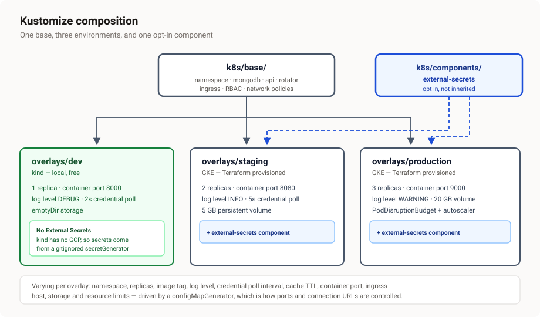
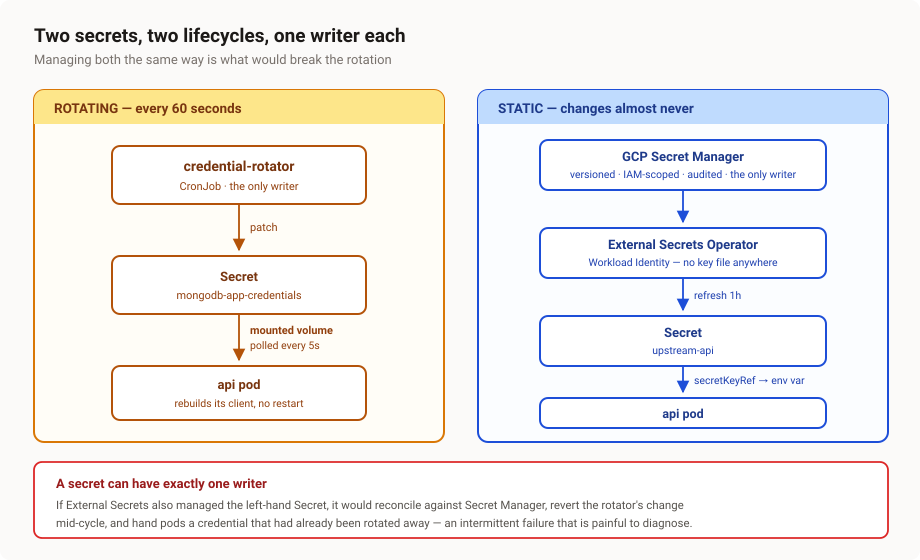

# Technical documentation

A complete description of what was built, how it works, and what was learned building it.
For the *why* behind each choice see [DECISIONS.md](DECISIONS.md); for secret handling
specifically see [SECRETS.md](SECRETS.md).

---

## 1. System overview

A caching proxy in front of a public text-search API (TMDB), backed by MongoDB, running on
Kubernetes, whose database credentials are replaced every sixty seconds by a CronJob
without dropping requests or restarting pods.

| Component | Technology | Role |
|---|---|---|
| `api` | Python 3.12, FastAPI, motor | Proxy, cache, credential hot-swap |
| `mongodb` | MongoDB 7.0 | Response cache (TTL) + query history |
| `credential-rotator` | Python 3.12, pymongo, kubernetes | Rotates users, patches the Secret |
| Ingress | ingress-nginx | External entry point |
| Cloud | Terraform, GKE, Secret Manager, KMS | staging + production infrastructure |

---

## 1a. Visual overview

### Architecture


The request path is in slate, the rotation loop in amber. Note that MongoDB sits on the
request hot path rather than beside it: every request reads from it and most write, so a
broken connection cannot hide behind a cache when the load test later claims rotation is
safe.

### Why two users, and why the overlap is required


This is the single most important property of the design. Rotation and kubelet propagation
both take up to sixty seconds against a sixty-second schedule, so they race each other.
Rotating only the *inactive* user means two credentials are valid at every instant, and a
pod that is up to a minute behind still authenticates successfully.

### Kustomize composition



External Secrets is a Component rather than duplicated manifests, so staging and production
opt in while dev deliberately does not — kind has no GCP to authenticate against.

### The two secret lifecycles



Each secret has exactly one writer. Mixing the two mechanisms is the mistake that would
break rotation, and §6 of SECRETS.md explains why in detail.

### Pod startup states

The application never blocks startup on the database:

```
Starting ──▶ Serving          HTTP server binds immediately
             │
             ▼
         Connecting ──┐       liveness OK, readiness 503
             │        │       auth fails → retry with backoff
             │        └───────┘       (pod is NOT restarted)
             ▼
           Ready ◀──▶ Swapping        credential changed:
                                      verify new client, then swap;
                                      on failure keep the old client
```

Blocking startup instead would exit the process, so the server would never bind, both
probes would fail on connection-refused, and the pod would enter CrashLoopBackOff with
backoff far outlasting the actual problem. This was observed in practice — see §9.

---

## 2. Application

Five modules under `app/src/`, each with one responsibility.

**`config.py`** — settings from environment variables, prefixed `APP_`. Notably it holds
`mongo_uri_template`, a connection string with `{username}` / `{password}` placeholders.
Credentials are injected at connect time rather than baked into config, so a rotation never
requires rebuilding configuration.

**`credentials.py`** — reads and watches the mounted credential Secret. It **polls** on a
short interval rather than using inotify. This is deliberate: the kubelet updates a mounted
Secret by writing a new timestamped directory and atomically swapping a `..data` symlink,
so an inotify watch on the individual file never fires. That implementation appears to work
locally and silently fails in Kubernetes. Polling is immune to the swap, costs nothing at a
5-second interval, and behaves identically everywhere.

**`db.py`** — owns the active MongoDB client and swaps it in place. Detailed in §4.

**`upstream.py`** — the TMDB client. The user controls only the value of a single query
*parameter*; scheme, host and path are fixed constants. At no point can user input
influence the destination URL, which is the SSRF vector in any proxy of this shape. The API
key never appears in logs or in errors returned to callers, and every call is bounded by a
timeout so a slow third party cannot exhaust the connection pool.

**`main.py`** — routes and lifecycle.

| Endpoint | Purpose |
|---|---|
| `GET /search?q=` | The proxy. Cache lookup → upstream on miss → store → history → return |
| `GET /history` | Recent queries from MongoDB |
| `GET /healthz` | Liveness — deliberately does **not** touch the database |
| `GET /readyz` | Readiness — pings the *currently active* client |
| `GET /rotation` | Observability: active username and rotations applied |
| `GET /docs` | Generated OpenAPI UI |

### Request flow

```
client → validate query (length, control chars)
       → MongoDB cache lookup
           hit  → return cached payload         (source: "cache")
           miss → call TMDB
                → upsert into cache (TTL index)
                → return payload                (source: "upstream")
       → record in query history
```

The database is deliberately on the hot path. Every request reads and most write, so a
broken connection cannot hide behind a cache during the load test.

### Liveness versus readiness

These check different things on purpose. **Liveness never touches MongoDB** — a liveness
failure kills the pod, so if it checked the database, a brief database outage would restart
every replica simultaneously and convert a recoverable blip into a cascading failure.
Database health belongs in readiness, which removes the pod from the Service without
killing it.

### Startup is decoupled from database availability

The application does **not** connect during startup. It binds the HTTP server immediately
and connects in a background task with exponential backoff.

This is a correctness requirement, not a nicety. On a fresh cluster the app starts before
the rotator has ever run, so the published credential is still a placeholder and
authentication fails. If startup blocked on the database, the process would exit, the
server would never bind, both probes would fail on connection-refused, and the pod would
enter CrashLoopBackOff with backoff growing into minutes — far outlasting the problem
itself. This was observed in practice; see §9.

---

## 3. Configuration model

Configuration arrives from two places and the split is deliberate.

| | Source | Why |
|---|---|---|
| Host, port, database, auth source, log level, cache TTL | **Environment variables**, from a ConfigMap Kustomize varies per overlay | Satisfies the brief's "connection using environment variables"; also how ports and connection URLs are controlled per environment |
| Upstream API key | **Environment variable** from a Secret via `secretKeyRef` | It does not rotate, so env is appropriate |
| Database username and password | **Mounted file**, from a Secret volume | Env vars are frozen at process start and *cannot* rotate |

The final connection string is assembled from both at connect time. Requirement 7 (env
vars) and requirement 14 (rotation) appear to conflict; this split satisfies both.

---

## 4. Credential rotation

The core of the system.

### The rotator, once per minute

```
1. Read the Secret → which user is active?          (app_a or app_b)
2. Choose the OTHER user                             (the inactive one)
3. Generate a 32-byte random password
4. db.updateUser() in MongoDB   (createUser on first run)
5. Authenticate AS that user to prove it works
6. Only now, patch the Kubernetes Secret
```

Step 5 before step 6 is the safety property. Publishing a credential before proving it
works is the one way this design could cause an outage, so it is deliberately last. If
verification fails the run aborts without touching the Secret and pods keep using the
previous credential — still valid, because of the overlap below.

### Why two alternating users

Rotating the *inactive* user means any published credential stays valid for **two full
cycles**, roughly two minutes.

That overlap is required rather than decorative. A mounted Secret can take **up to 60
seconds** to propagate to a pod, and the schedule is also 60 seconds, so propagation and
rotation race each other. Rotating the active user directly would mean a pod that had not
yet seen the update was holding a password that no longer worked.

```
t=0    app_a active.  Rotate app_b → new password.  Secret → app_b.
t=60   app_b active.  Rotate app_a → new password.  Secret → app_a.
t=120  app_a active.  Rotate app_b …

Any credential is valid from the moment it is set until it is rotated
again two cycles later.
```

MongoDB helps here in a way that is easy to miss: **changing a user's password does not
terminate existing authenticated connections.** Already-open pooled connections keep
working; only new connections need the new credential. That gives the application a grace
period to swap on its own terms rather than being forced into a hard cutover.

### The application side

```
1. Poll detects the mounted files changed
2. Build a NEW client with the new credentials   (old one still serving)
3. Ping it — if it fails, discard and keep serving on the old client
4. Atomically swap the active reference          (attribute rebind, atomic under the GIL)
5. Close the old client after a drain delay      (in-flight queries finish)
```

Because the active client is only ever replaced by a verified-working one, **readiness
never flaps**. That matters more than it sounds: if `/readyz` failed during a swap, the
Service would remove the pod from its endpoints and clients would see 503s — precisely the
downtime this design exists to avoid.

No restart occurs at any point.

---

## 5. Kubernetes topology

`k8s/base/` holds everything common:

- **`namespace.yaml`** — enforces the `restricted` Pod Security Standard, so the API server
  *rejects* non-conforming pods rather than running them.
- **`mongodb.yaml`** — headless Service plus StatefulSet, started with `--auth`.
- **`api.yaml`** — Service and Deployment. `maxUnavailable: 0` so a rolling update never
  removes a pod before its replacement is ready.
- **`secrets.yaml`** — only the rotating credential. It must be a plain Secret, not a
  `secretGenerator`, because a generator appends a content hash to the name and would fight
  a CronJob that patches in place.
- **`rotator.yaml`** — ServiceAccount, Role, RoleBinding, CronJob.
- **`ingress.yaml`**, **`networkpolicy.yaml`**.

### Kustomize layout

```
base/                          common resources
components/external-secrets/   opt-in fragment: Secret Manager → Kubernetes Secrets
overlays/dev/                  kind. 1 replica, DEBUG, 2s poll, local secretGenerator
overlays/staging/              GKE. 2 replicas, PVC, port 8080, External Secrets
overlays/production/           GKE. 3 replicas, PDB, HPA, larger PVC, port 9000
```

External Secrets is a **Component** rather than duplicated manifests, because staging and
production share it while dev deliberately opts out — kind has no GCP, so dev generates
secrets from gitignored local files instead.

What varies per overlay: namespace, replica count, image tag, log level, credential poll
interval, cache TTL, **container port**, ingress host, storage, and resource limits.

The port variation is worth a note. Varying an application's internal listen port per
environment is unusual in practice — real systems normally keep the container port constant
and vary the Service or Ingress. It is implemented here because the brief explicitly asks
for ports to be controlled through Kustomize. The Service `targetPort` and both probes
reference the port by **name**, so they follow automatically.

---

### Resource inventory

What each overlay actually produces, verified with `kustomize build | grep '^kind:'`:

| Resource | dev | staging | production | Purpose |
|---|:--:|:--:|:--:|---|
| Namespace | 1 | 1 | 1 | Enforces the `restricted` Pod Security Standard |
| Deployment | 1 | 1 | 1 | The API — 1 / 2 / 3 replicas respectively |
| StatefulSet | 1 | 1 | 1 | MongoDB, single replica |
| Service | 2 | 2 | 2 | `api` (ClusterIP) and `mongodb` (headless) |
| Ingress | 1 | 1 | 1 | ingress-nginx entry point |
| CronJob | 1 | 1 | 1 | The credential rotator, `* * * * *` |
| ConfigMap | 1 | 1 | 1 | Non-secret config, varied per overlay |
| Secret | 3 | 1 | 1 | See the note below — the counts differ for a reason |
| SecretStore | – | 1 | 1 | External Secrets → GCP Secret Manager |
| ExternalSecret | – | 2 | 2 | Projects the API key and MongoDB admin password |
| ServiceAccount | 1 | 1 | 1 | `credential-rotator` only |
| Role + RoleBinding | 2 | 2 | 2 | Least-privilege RBAC for the rotator |
| NetworkPolicy | 5 | 5 | 5 | Default-deny plus four explicit allows |
| PodDisruptionBudget | – | – | 1 | Keeps ≥2 replicas during node drains |
| HorizontalPodAutoscaler | – | – | 1 | 3→10 replicas at 70% CPU |
| **Total** | **19** | **20** | **22** | |

**Why the Secret counts differ.** Dev has three: the rotating `mongodb-app-credentials`
plus two produced by `secretGenerator` from gitignored local files. Staging and production
have only the one plain Secret in their manifests — their other two are created *at
runtime* by External Secrets from Secret Manager, which is why `SecretStore` and
`ExternalSecret` appear instead. Same three Secrets exist in every cluster; only the source
differs.

**The five NetworkPolicies** are `default-deny-all`, `allow-dns`, `api-policy`,
`mongodb-policy` and `rotator-policy`.

### What actually runs

A steady-state dev cluster:

```
NAME                                READY   STATUS      AGE
pod/api-8f5c757cd-8gdfl             1/1     Running     20m     ← 2 in staging, 3 in production
pod/mongodb-0                       1/1     Running     63m
pod/credential-rotator-...-n7knd    0/1     Completed   2m26s   ← one per minute,
pod/credential-rotator-...-6rr2r    0/1     Completed   86s        three retained by
pod/credential-rotator-...-j5t6h    0/1     Completed   26s        successfulJobsHistoryLimit

service/api       ClusterIP   10.96.54.178   80/TCP
service/mongodb   ClusterIP   None           27017/TCP    ← headless
```

The rotator pods accumulating as `Completed` is expected: each CronJob run is a new Job,
and `successfulJobsHistoryLimit: 3` keeps the last three so their logs stay inspectable.

### Where each resource is defined

| File | Resources |
|---|---|
| `k8s/base/namespace.yaml` | Namespace |
| `k8s/base/mongodb.yaml` | Service (headless), StatefulSet |
| `k8s/base/api.yaml` | Service, Deployment |
| `k8s/base/secrets.yaml` | Secret (rotating credential only) |
| `k8s/base/rotator.yaml` | ServiceAccount, Role, RoleBinding, CronJob |
| `k8s/base/ingress.yaml` | Ingress |
| `k8s/base/networkpolicy.yaml` | 5 × NetworkPolicy |
| `k8s/base/kustomization.yaml` | ConfigMap (via `configMapGenerator`) |
| `k8s/components/external-secrets/` | SecretStore, 2 × ExternalSecret |
| `k8s/overlays/dev/kustomization.yaml` | 2 × Secret (via `secretGenerator`) |
| `k8s/overlays/production/pdb.yaml` | PodDisruptionBudget |
| `k8s/overlays/production/hpa.yaml` | HorizontalPodAutoscaler |

---

## 6. Security controls

**Pods** — non-root (UID 10001/10002), read-only root filesystem, no privilege escalation,
all capabilities dropped, `RuntimeDefault` seccomp. The API pod sets
`automountServiceAccountToken: false`; it never talks to the Kubernetes API.

**RBAC** — the rotator is the only component with Kubernetes API access. Its Role is
namespaced, pinned to one Secret via `resourceNames`, and limited to `get` and `patch`.
There is deliberately **no `list` or `watch`**: those verbs ignore `resourceNames`
entirely, so granting them would silently expose every Secret in the namespace.

**Network** — default-deny on ingress *and* egress, then explicit allows. Egress
default-deny is the half usually skipped, and it is what prevents a compromised container
from calling out.

**GCP** — a dedicated least-privilege node service account rather than the default Compute
Engine account (which carries project-wide Editor); Workload Identity so pods get GCP
identity with no key files; Shielded nodes; Dataplane V2; Cloud KMS envelope encryption of
Secrets in etcd.

**Supply chain** — multi-stage builds on slim bases, Trivy failing CI on HIGH/CRITICAL, and
Workload Identity Federation for CI with an attribute condition pinning it to this
repository. **No service account key exists anywhere.**

---

## 7. Infrastructure (Terraform)

Terraform owns the cloud; Kustomize owns the cluster interior. The boundary is strict —
managing Kubernetes objects with Terraform's Kubernetes provider alongside Kustomize causes
state conflicts and is a known anti-pattern.

Resources: a purpose-built VPC with secondary ranges for pods and services, two zonal GKE
clusters, a least-privilege node service account, Artifact Registry with cleanup policies,
Secret Manager entries for the API key and a Terraform-generated MongoDB admin password,
a KMS key for etcd encryption, and Workload Identity Federation for GitHub Actions.

Cost control is explicit: Spot nodes, `e2-medium`, 30GB disks (the GKE default is 100GB),
`deletion_protection = false` so `terraform destroy` actually works, and an
`estimated_hourly_cost_usd` output. Private nodes are a variable rather than a hardcoded
choice, because they require Cloud NAT at roughly $32/month per cluster — more than every
other resource combined.

---

## 8. Test evidence

`load/rotation-test.js`, run against the kind cluster for six minutes:

```
✓ http_req_failed ....... 0.00%    0 out of 7066
✓ rotations_observed .... 8        (threshold: ≥5)
  credential_switches ... 4
  checks ................ 100.00%  13892 out of 13892
✓ http_req_duration ..... p95=34.83ms
```

**7,066 requests, zero failures, across 8 rotations.** The test also fails if fewer than
five rotations occur, so a green result cannot be achieved by simply not rotating.

---

## 9. Bugs found during implementation

All three were found only by actually running the system. None were visible in
`kustomize build` or `terraform validate`.

**The app crash-looped on first deploy.** It connected to MongoDB during startup, before
the rotator had created any users, so authentication failed and the process exited.
CrashLoopBackOff backoff then grew far beyond the actual problem. Fixed by connecting in a
background task — see §2.

**The rotator hung silently on every run.** It created the user, verified the credential,
then never exited; the Job was killed at its 50-second deadline having never published.
Cause: `publish()` constructed a *second* Kubernetes `ApiClient`, and each one spawns a
thread pool whose threads keep the interpreter alive after `main()` returns. Fixed by
context-managing a single client and adding explicit request timeouts, so a hang can never
again present as silence.

**A NetworkPolicy blocked the Kubernetes API server.** The egress rule allowed port 443,
which is what the pod connects to — but the `kubernetes` Service DNATs `10.96.0.1:443` to
the control plane on port **6443**, and the CNI evaluates egress against the post-DNAT
destination. Traffic was dropped with no error. Now both ports are allowed, which is also
portable: managed control planes such as GKE terminate on 443, so a policy listing only one
port works in exactly one environment.

A related correction: current kind versions **do** enforce NetworkPolicy via kindnetd. An
earlier comment in this repository claimed they do not.

---

## 10. Known gaps

Stated rather than hidden.

- **No unit tests.** The rotation logic and credential watcher are the obvious candidates.
- **MongoDB is a single replica.** The application survives credential rotation; it would
  not survive losing its only database pod.
- **The MongoDB admin password does not rotate.** `MONGO_INITDB_ROOT_PASSWORD` applies only
  at first startup, so changing it afterwards would lock the rotator out without warning.
  Rotating it properly needs a coordinated change inside MongoDB.
- **GitHub Actions are pinned to version tags, not commit SHAs.** Tags are mutable.
- **No metrics or alerting.** A silently failing rotator would only be noticed once
  credentials expired. Rotation lag and swap duration should be Prometheus metrics with an
  alert after two missed cycles.
- **Private nodes are off** by default, on cost grounds. One variable away.
